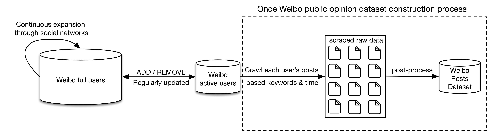
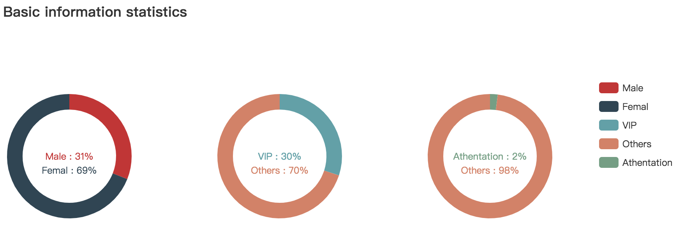
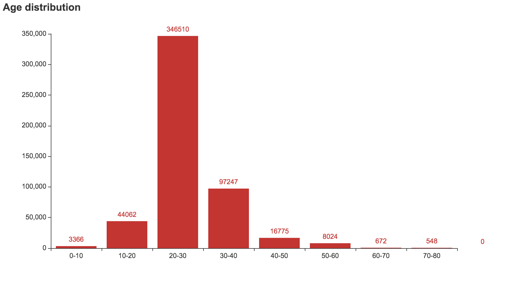
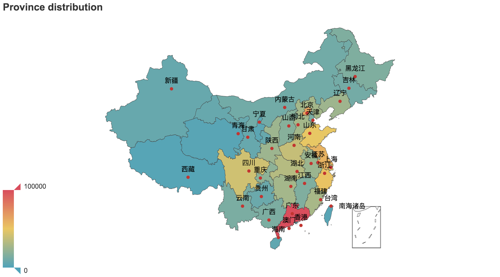

<h1 align="center">weibo-public-opinion-dataset</h1>

<p align="center">持续维护的新浪微博舆情数据集(仅供科研使用)</p>

<p align="center">
  <a href="https://github.com/nghuyong/weibo-public-opinion-datasets/stargazers">
    
  </a>
  <a href="https://github.com/nghuyong/weibo-public-opinion-datasets/issues">
        
  </a>
  <a href="https://github.com/nghuyong/weibo-public-opinion-datasets/">
        
  </a>
  <a href="https://github.com/nghuyong/weibo-public-opinion-datasets/blob/master/LICENSE">
        
  </a>
</p>

<h2 align="center">简介</h2>
新浪微博是中国最大的公开社交媒体平台，最新最热门的社会事件都会第一时间在微博进行披露和讨论，
所以构建实时全量的微博舆情数据集具有重要的意义。目前构建微博舆情数据集有两种方法: 

1. 基于舆情关键词搜索的方式，但是由于微博搜索接口的限制，指定的关键词在指定的日期只能获取至多1000条数据，
数据集的整体数量过低。
2. 基于遍历全网微博用户的方式，从每个用户的微博主页抓取指定时间段内包含舆情关键词的微博，
从而获得全量的舆情数据，但是遍历全网上亿微博用户需要大量的带宽，IP资源和时间，所以数据集构建效率过低。



我们提出一种新的微博舆情构建方式，能保持数据相对全量的情况下，大幅提高抓取效率。
具体而言，我们动态维护一个"微博活跃用户池"，仅遍历这部分用户的微博主页抓取指定时间段包括舆情关键词的微博，

经实验对比，相对上述方法1，构建数据集的数据量大幅提高，热门舆情关键词提高超过**1000倍**；相对方法2，数据完备性保持90%以上，构建效率提高**20倍**！


<h2 align="center">微博活跃用户池</h2>
我们基于微博种子用户和通过社交关系持续扩列的方式，构建了超过3亿的微博全量用户池，
进而基于筛选规则构建"微博活跃用户池"，规则如下表所示。

|项目|规则|占比|
|:---:|:---:|:---:|
|粉丝数| 大于50 |0.72|
|关注数| 大于50 |0.33|
|微博数| 大于50 |0.31|
|最新的发文时间| 小于30天 |0.26|

经过筛选，微博活跃用户池数量占全体微博用户的比例约为5%.

|下载地址|活跃用户数量|更新时间|
|:---:|---:|---:|
|https://pan.baidu.com/s/18IRuefIpKO4blJd2OWLuhg code:1g99|1,000,000|2020-2-20|

## 数据格式

数据格式为json格式，数据样例如下:

```json
[
    {
        "_id": "3487305784",
        "crawl_time": 1575952986,
        "nick_name": "佳欣_",
        "gender": "女",
        "province": "北京",
        "city": "朝阳区",
        "brief_introduction": "开心最重要！！",
        "birthday": "1997-12-08",
        "sex_orientation": "异性恋",
        "sentiment": "单身",
        "vip_level": "6级",
        "authentication": "贾征宇超话粉丝大咖",
        "labels": "爱猫,美食爱好者,爱玩",
        "fans_num": 614,
        "follows_num": 226,
        "tweets_num": 5635
    }, 
    ...
]
```
## 用户分析








<h2 align="center">微博舆情数据集</h2>

|舆情事件|时间范围|数据总量|更新时间|其他详情|
|:---:|:---:|:---:|:---:|:---:|
|武汉疫情|2019-12-30 - 至今| |2020-2-20|[关键词表]() / [词云分析]() / [下载链接]()|

## 数据格式

数据格式为json格式，数据样例如下:

```json
[
  {
    "_id": "2740680867_IghlTuUPn",
    "crawl_time": 1581347379,
    "weibo_url": "https://weibo.com/2740680867/IghlTuUPn",
    "user_id": "2740680867",
    "created_at": "2019-11-15 07:55:41",
    "tool": "HUAWEI P10",
    "like_num": 0,
    "repost_num": 0,
    "comment_num": 0,
    "image_url": [
        "http://wx1.sinaimg.cn/wap180/a35b78a3ly1g8ye6wzohbj21q83287wh.jpg"
    ],
    "location_map_info": "119.175289,36.631213",
    "content": "真的是大雁南飞了 潍坊 显示地图"
  },
  ...
]
```

<h2 align="center">引用本工作</h2>
如果本工作对您有所帮助，欢迎在论文中进行引用:

```
@misc{nghuyong2020@weibo-public-opinion-dataset,
  title={weibo-public-opinion-dataset},
  author={Yong Hu},
  howpublished={\url{https://github.com/nghuyong/weibo-public-opinion-dataset}},
  year={2020}
}
```


