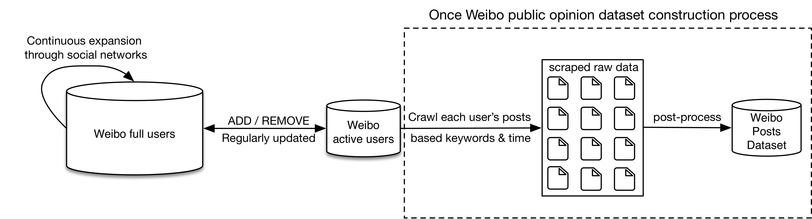
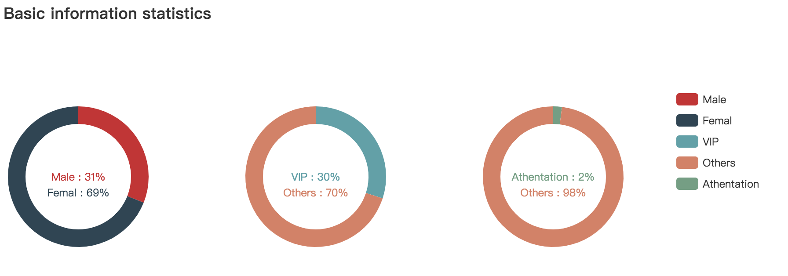
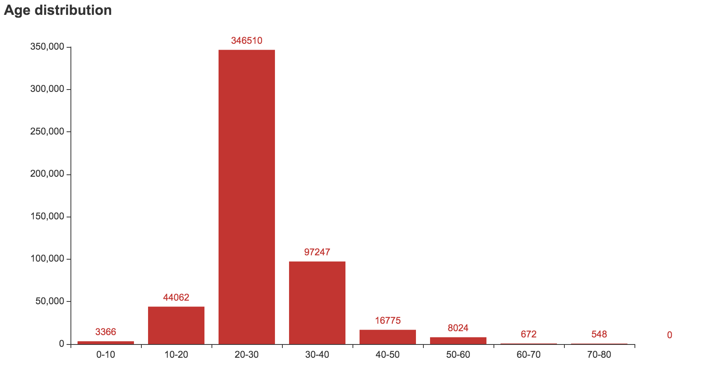
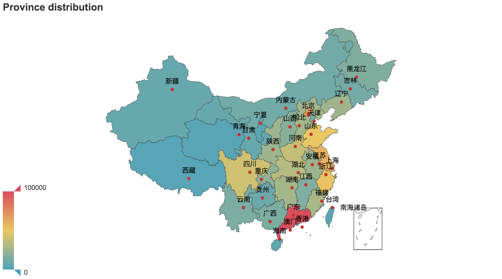

<h1 align="center">weibo-public-opinion-datasets</h1>

<p align="center">Continuously updated Sina Weibo Public Opinion Datasets (only for research use)<a href="./readme-zh.md">中文版本</a></p>

<p align="center">
  <a href="https://github.com/nghuyong/weibo-public-opinion-datasets/stargazers">
    
  </a>
  <a href="https://github.com/nghuyong/weibo-public-opinion-datasets/issues">
        
  </a>
  <a href="https://github.com/nghuyong/weibo-public-opinion-datasets/">
        
  </a>
  <a href="https://github.com/nghuyong/weibo-public-opinion-datasets/blob/master/LICENSE">
        
  </a>
</p>

<h2 align="center">Introduction</h2>
Sina Weibo is Chinese largest public social media platform. 
The latest and most popular social events will be disclosed and discussed on Weibo as soon as possible.
Therefore, it is of great significance to build a real-time and full-scale Weibo public opinion dataset.
At present, there are two methods for constructing Weibo public opinion datasets: 

1. Searching public opinion keywords, but due to the limitation of the Weibo search interface, the specified keywords can only obtain up to 1000 data on the specified date.
The overall number of datasets is too low. 
2. Traversing nearly all Weibo users and crawl tweets containing public opinion keywords within a specified period.
However, traversing the billion Weibo users requires a lot of bandwidth, IP resources and time!
The overall construction efficiency of datasets is too low.





We propose a new way of constructing Weibo public opinion datasets, which can greatly improve the crawling efficiency while maintaining a relatively full amount of data.
Specifically, we dynamically maintain a weibo active user pool,
which only traverses the homepage of this group of users to crawl tweets that include public opinion keywords and in a specific period of time.

After experimental comparison, compared with the above method 1, the amount of data for constructing the dataset is greatly increased, 
and especially for popular public opinion keywords, the amount of data is increased by more than **1000 times**; 
compared with the method 2, the data completeness is maintained above **90%**, and the construction efficiency is increased by **20 times**!

<h2 align="center">Weibo Active User Pool</h2>
Based on init seed users and continuous expansion through social relationships, 
we have built a nearly full Weibo user pool of more than 300 million.
Furthermore, the weibo active user pool is constructed based on some filtering rules, and the rules are shown in the following table.

|Item|Rule|Ratio|
|:---:|:---:|:---:|
|Follows number| \> 50 |0.72|
|Fans number| \> 50 |0.33|
|Tweets number| \> 50 |0.31|
|Recent post| \< 30 days | 0.26 |

After filtering, the number of Weibo active user pools accounts for about 5% of all Weibo users.

|Download link|Active users|Update time|
|:---:|---:|---:|
|https://pan.baidu.com/s/18IRuefIpKO4blJd2OWLuhg code:1g99|1,000,000|2020-2-20|

## Data Format
The data format is json. For example:

```json
[
    {
        "_id": "3487305784",
        "crawl_time": 1575952986,
        "nick_name": "佳欣_",
        "gender": "女",
        "province": "北京",
        "city": "朝阳区",
        "brief_introduction": "开心最重要！！",
        "birthday": "1997-12-08",
        "sex_orientation": "异性恋",
        "sentiment": "单身",
        "vip_level": "6级",
        "authentication": "贾征宇超话粉丝大咖",
        "labels": "爱猫,美食爱好者,爱玩",
        "fans_num": 614,
        "follows_num": 226,
        "tweets_num": 5635
    }, 
    ...
]
```

## Analysis







<h2 align="center">Weibo Public Opinion Datasets</h2>

|Events|Time Range|Amount|Update time|Other details|
|:---:|:---:|:---:|:---:|:---:|
|Wuhan pneumonia epidemic |2019-12-30 - Now| |2020-2-20|[Keyword list]() / [Word cloud analysis]() / [Download link]()|

## Data Format
The data format is json. For example:

```json
[
  {
    "_id": "2740680867_IghlTuUPn",
    "crawl_time": 1581347379,
    "weibo_url": "https://weibo.com/2740680867/IghlTuUPn",
    "user_id": "2740680867",
    "created_at": "2019-11-15 07:55:41",
    "tool": "HUAWEI P10",
    "like_num": 0,
    "repost_num": 0,
    "comment_num": 0,
    "image_url": [
        "http://wx1.sinaimg.cn/wap180/a35b78a3ly1g8ye6wzohbj21q83287wh.jpg"
    ],
    "location_map_info": "119.175289,36.631213",
    "content": "真的是大雁南飞了 潍坊 显示地图"
  },
  ...
]
```

<h2 align="center">Citation</h2>
If you use this work in a scientific publication, I would appreciate references to the following BibTex entry:

```
@misc{nghuyong2020@weibo-public-opinion-dataset,
  title={weibo-public-opinion-dataset},
  author={Yong Hu},
  howpublished={\url{https://github.com/nghuyong/weibo-public-opinion-dataset}},
  year={2020}
}
```